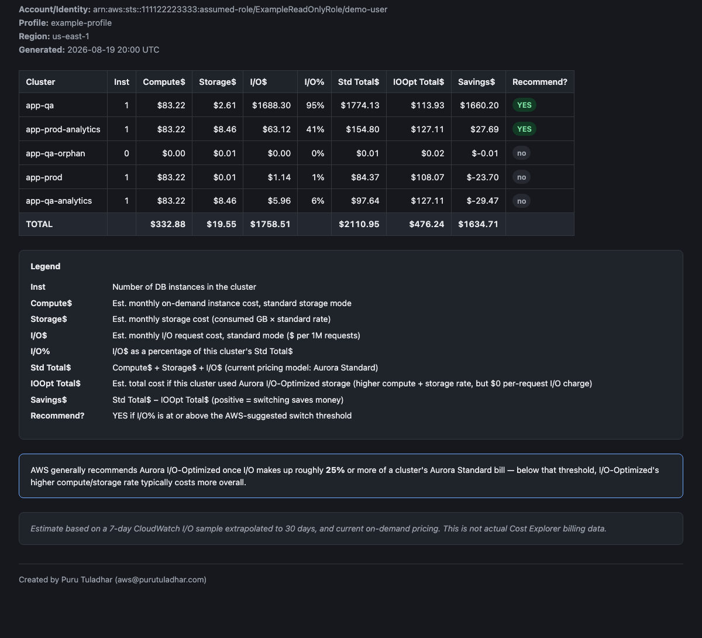

# Aurora I/O Cost Analysis

A zero-dependency Python script that estimates **compute, storage, and I/O spend**
for every Amazon Aurora cluster in a region, and tells you which clusters would
actually save money by switching to **Aurora I/O-Optimized** storage.

It answers the question: *"My Aurora bill is high — is it I/O, and would
I/O-Optimized fix it?"* without needing Cost Explorer resource-level billing
(which many accounts don't have enabled).



> The screenshot above uses synthetic example data (fake account ID, cluster
> names, and identity) — no real AWS account information is included.

## How it works

The script uses only the local `aws` CLI (no `boto3`/pip install required):

1. Lists every Aurora cluster (`aurora-postgresql` / `aurora-mysql`) in the
   target region via `rds describe-db-clusters`.
2. Pulls each cluster's current storage size (`VolumeBytesUsed`) and I/O volume
   (`VolumeReadIOPs` + `VolumeWriteIOPs`) from CloudWatch, extrapolated to a
   30-day month.
3. Looks up current on-demand pricing for both **Aurora Standard** and
   **Aurora I/O-Optimized** via the AWS Price List API (`pricing get-products`).
4. Computes a monthly cost estimate for each pricing model, and flags any
   cluster where switching would save money.

This is an **estimate**, not actual billing data — see [Limitations](#limitations).

## Requirements

- Python 3.8+
- AWS CLI v2, already authenticated (`aws sso login`, `aws login`, or static
  credentials — anything the CLI's default credential chain can resolve)
- IAM permissions (read-only):

  ```json
  {
    "Version": "2012-10-17",
    "Statement": [
      {
        "Effect": "Allow",
        "Action": [
          "rds:DescribeDBClusters",
          "rds:DescribeDBInstances",
          "cloudwatch:GetMetricStatistics",
          "pricing:GetProducts",
          "sts:GetCallerIdentity"
        ],
        "Resource": "*"
      }
    ]
  }
  ```

## Usage

```bash
# Print an ASCII table to the terminal
python3 aurora_io_cost_analysis.py --profile my-profile --region ap-southeast-1

# Widen the CloudWatch sample window used for the I/O estimate (default: 7 days)
python3 aurora_io_cost_analysis.py --profile my-profile --region ap-southeast-1 --io-lookback-days 14

# Generate a shareable HTML report instead
python3 aurora_io_cost_analysis.py --profile my-profile --region ap-southeast-1 --output html
```

| Flag | Default | Description |
|---|---|---|
| `--profile` | *(AWS CLI default)* | AWS CLI profile to use |
| `--region` | *(required)* | AWS region, e.g. `ap-southeast-1` |
| `--io-lookback-days` | `7` | Days of CloudWatch history to average I/O from |
| `--output` | `text` | `text` (terminal table) or `html` (shareable report file) |
| `--output-file` | `aurora_io_cost_report.html` | Output path, only used with `--output html` |

## Sample output (terminal)

```
Running as: arn:aws:sts::111122223333:assumed-role/ExampleReadOnlyRole/demo-user
Profile:    example-profile
Region:     us-east-1

Discovering Aurora clusters...
Found 5 Aurora cluster(s): app-qa, app-prod-analytics, app-qa-orphan, app-prod, app-qa-analytics

Gathering CloudWatch metrics (I/O lookback window: 7 day(s) -- use --io-lookback-days N to change this)...
  [1/5] app-qa: fetching storage + I/O usage...
  ...

+---------------------+------+----------+----------+----------+------+------------+--------------+----------+------------+
| Cluster             | Inst | Compute$ | Storage$ | I/O$     | I/O% | Std Total$ | IOOpt Total$ | Savings$ | Recommend? |
+---------------------+------+----------+----------+----------+------+------------+--------------+----------+------------+
|              app-qa |    1 |   $83.22 |    $2.61 | $1688.30 |  95% |   $1774.13 |      $113.93 | $1660.20 |        YES |
| app-prod-analytics  |    1 |   $83.22 |    $8.46 |   $63.12 |  41% |    $154.80 |      $127.11 |   $27.69 |        YES |
|       app-qa-orphan |    0 |    $0.00 |    $0.01 |    $0.00 |   0% |      $0.01 |        $0.02 |   $-0.01 |         no |
|            app-prod |    1 |   $83.22 |    $0.01 |    $1.14 |   1% |     $84.37 |      $108.07 |  $-23.70 |         no |
|    app-qa-analytics |    1 |   $83.22 |    $8.46 |    $5.96 |   6% |     $97.64 |      $127.11 |  $-29.47 |         no |
+---------------------+------+----------+----------+----------+------+------------+--------------+----------+------------+
```

## Legend

| Column | Meaning |
|---|---|
| `Inst` | Number of DB instances in the cluster |
| `Compute$` | Est. monthly on-demand instance cost, standard storage mode |
| `Storage$` | Est. monthly storage cost (consumed GB × standard rate) |
| `I/O$` | Est. monthly I/O request cost, standard mode ($ per 1M requests) |
| `I/O%` | `I/O$` as a percentage of the cluster's `Std Total$` |
| `Std Total$` | `Compute$ + Storage$ + I/O$` under Aurora Standard pricing |
| `IOOpt Total$` | Est. total cost under Aurora I/O-Optimized (higher compute/storage rate, $0 per-request I/O) |
| `Savings$` | `Std Total$ - IOOpt Total$` — positive means switching saves money |
| `Recommend?` | `YES` once `I/O%` crosses the switch threshold (default 25%, AWS's general guidance) |

## Limitations

- **Estimate, not a bill.** Figures come from a CloudWatch usage sample
  extrapolated to 30 days and current on-demand pricing — not Cost Explorer's
  actual billed amounts. Real traffic is bursty; a short sample window can
  over- or under-state the monthly figure.
- **On-demand pricing only.** Reserved Instances, Savings Plans, or negotiated
  discounts aren't reflected.
- **Aurora Serverless v2** instances (`db.serverless`) are skipped for compute
  pricing (ACU-based pricing isn't modeled) — storage and I/O are still
  estimated.
- **Multi-AZ / cross-region replicas, backup storage, and snapshot export**
  costs aren't included.
- For an authoritative per-cluster answer, use the RDS console's built-in
  **"Storage type comparison"** (shown when modifying a cluster's storage
  type), which uses your actual historical usage.

## License

MIT

---

Created by Puru Tuladhar (aws@purutuladhar.com)
